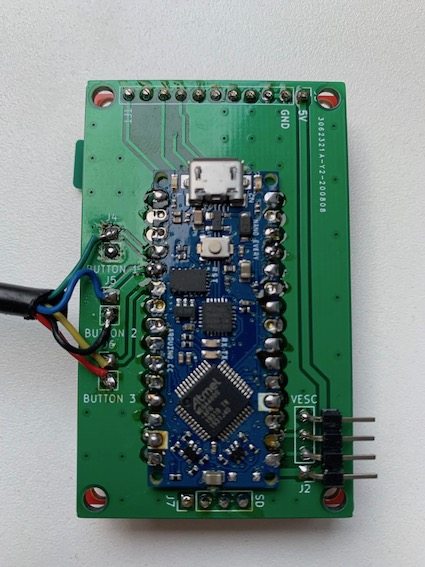
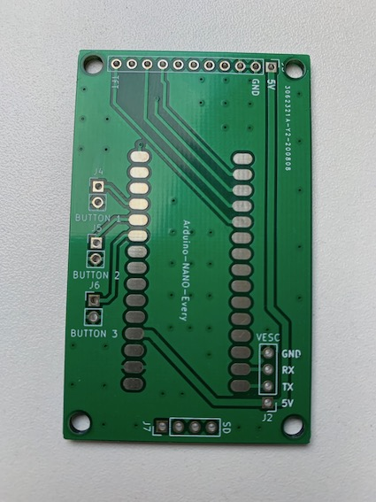
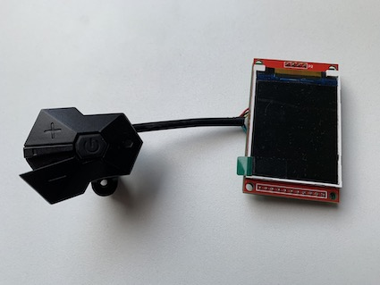

*This repository contains the kciad and gerber files for the open source Roxie (based on [DAVEga OS](https://github.com/janpom/davega)).*

-----

## License

Roxie firmware and hardware design is released under [GNU GPL v3](https://github.com/charclo/roxie-firmware/blob/master/LICENSE).

